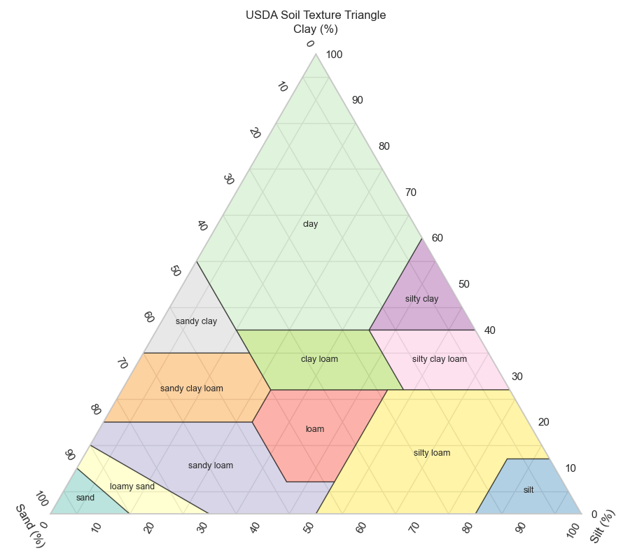

# **Not complete**

# Directory 
```
.
├── config - configuration files for the libraries.
├── data - example data files only used by CLI application. 
├── exclusion_rules - documentation for the exclusion rules library.
├── src
│   ├── app - CLI application for recommendation system. Does not use database.
│   ├── exclusion_rules - exclusion rules library code.
│   ├── scripts - miscellaneous scripts.
│   └── suitability_scoring - suitability scoring library code.
├── suitability_scoring - documentation and Jupyter notebooks for the suitability scoring library.
└── tests pyTest files for exclusion rules and suitability scoring libraries.
```

# Configuration
The global configuration for the suitability scoring is contained (`config/recommend.yaml`). The soil texture compatibility map in that file has been generated with the script `src/scripts/generate_soil_texture_compatibility_yaml`. The compatibility scores are set by adjacency on the texture triangle:

* exact = 1.0
* 1-step neighbours (e.g., loam ↔ sandy_loam) ≈ 0.8
* 2-step ≈ 0.6
* 3-step=0.4
* >=4-step=0.3
* hard incompatibilities as 0.0.



The rationale of this approach is that scores are monotonic with textural proximity, aligning with agronomic intuition (coarser textures differ in water holding and nutrient retention vs finer textures).

Species-specific overrides (`species_params`) are built into the database and in the current version cannot be changed once the database is initialised. Before database ingestion the parameters can be edited in the `..\src\scripts\data\species_params20260112.csv` file.


For a full description of how to configure the suitability scoring library documentation (`suitability_scoring/docs/scoring_design.md`).

# Usage