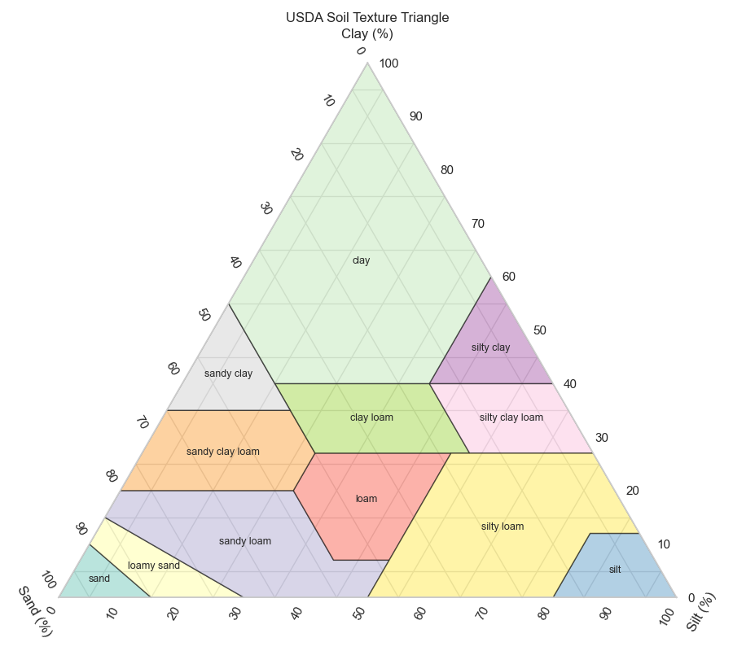

# Directory 
```
.
├── config - configuration files for the libraries.
├── data - example data files only used by CLI application. 
├── exclusion_rules - documentation for the exclusion rules library.
├── src
│   ├── app - CLI application for recommendation system. Does not use database.
│   ├── exclusion_rules - exclusion rules library code.
│   ├── scripts - miscellaneous scripts.
│   └── suitability_scoring - suitability scoring library code.
├── suitability_scoring - documentation and Jupyter notebooks for the suitability scoring library.
└── tests pyTest files for exclusion rules and suitability scoring libraries.
```

# Getting started

Install `uv` for your chosen OS from:
```
https://docs.astral.sh/uv/getting-started/installation/
```
and confirm it is installed with `uv --version`.
You should see something like 
```console
C:\...\Planting-Optimisation-Tool > uv --version
> uv 0.8.14
```
Then 
```bash
cd ..
cd datascience
```
Run `uv sync` to install all requirements from `pyproject.toml` for the datascience directory.

If there are additional python packages you require, run `uv add packagename` to add it to the project.

This project uses Ruff linter and formatter (https://docs.astral.sh/ruff/tutorial/) to enforce PEP 8 style guide for python (https://peps.python.org/pep-0008/)

To run, from the base directory of your team, enter `uv run ruff check` and it will test your code for issues. 

You can also choose to run `uv run ruff check --fix` to automatically fix any linting issues.


# Configuration
The global configuration for the suitability scoring is contained (`config/recommend.yaml`). The soil texture compatibility map in that file has been generated with the script `src/scripts/generate_soil_texture_compatibility_yaml`. The compatibility scores are set by adjacency on the texture triangle:

* exact = 1.0
* 1-step neighbours (e.g., loam ↔ sandy_loam) ≈ 0.8
* 2-step ≈ 0.6
* 3-step=0.4
* \>=4-step=0.3
* hard incompatibilities as 0.0.



The rationale of this approach is that scores are monotonic with textural proximity, aligning with agronomic intuition (coarser textures differ in water holding and nutrient retention vs finer textures).

Species-specific overrides (`species_params`) are built into the database and in the current version cannot be changed once the database is initialised. Before database ingestion the parameters can be edited in the `..\src\scripts\data\species_params20260112.csv` file.


For a full description of how to configure the suitability scoring library documentation (`docs/scoring_design.md`).

# Usage as a library
```{python}
# Load configuration and data
from yourlib import (
     load_yaml,
     build_species_params_dict,
     build_rules_dict,
     calculate_suitability,
     build_species_recommendations,
 )

# Load configuration file
cfg = load_yaml("config.yaml")

# Build parameters index and scoring rules
params = build_species_params_dict(species_params_rows, cfg)
rules = build_rules_dict(species_list, params, cfg)

# Score all species for the farm and get explanations
# farm single farm profile dict
results, scores = calculate_suitability(farm, species_list, rules, cfg)

# Produce ranked recommendations
recs = build_species_recommendations(results)
recs[:3]
[{'species_id': 101, 'species_name': 'X', 'species_common_name': 'Y',
  'score_mcda': 0.842, 'rank_overall': 1,
  'key_reasons': ['Soil:exact match', 'Rainfall:inside preferred range', ...]},
 ...]
```
