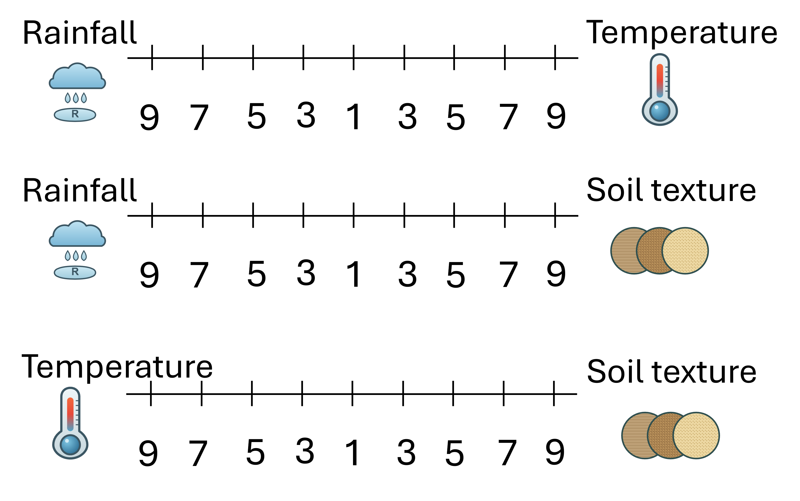
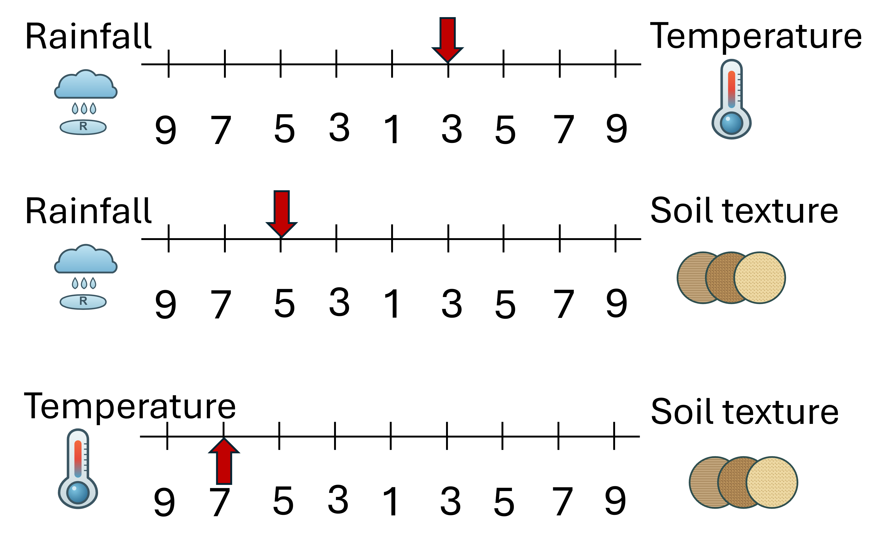

# Analytic Hierarchy Process	(AHP)	
Analytic Hierarchy Process (AHP) is a Multi Criteria decision making method that was developed by Prof. Thomas L. Saaty [1]. It is a method to derive ratio scales from paired comparisons. The input can be obtained from actual measurement such as price, weight etc., or from subjective opinion such as satisfaction feelings and preference. AHP allow some small inconsistency in judgment because a human is not always consistent. The ratio scales are derived from the principal Eigenvectors and the consistency index is derived from the principal Eigenvalue.  


## Pair‐wise comparison	
Suppose we have two environmental factors Rainfall and Temperature. I would like to ask you, which factor is more important for the growth of a particular species of tree. Let us make a relative scale
to measure how much you like the factor on the left (Rainfall) compared to the factor on the right (Temperature).


If you think Rainfall is more important than Temperature, you tick a mark between number 1 and 9 on left side, while if you think Temperature is more important than Rainfall, then you mark on the right side. 

For instance if a tree strongly favours Temperature to Rainfall then I give mark like this


Now suppose you have three choices of factors. Then the pair wise comparison goes as the following


You may observe that the number of comparisons is a combination of the number of things to be compared. Since we have three factors (Rainfall, Temperature and Soil Texture), we have three comparisons. Table  below shows the number of comparisons.

| Number of things      | 1 | 2 | 3 | 4 | 5  | 6  | 7  | n        |
|-----------------------|---|---|---|---|----|----|----|----------|
| Number of comparisons | 0 | 1 | 3 | 6 | 10 | 15 | 21 | n(n-1)/2 |

The scaling is not necessary 1 to 9 but for qualitative data such as preference, ranking and subjective opinions, it is suggested to use scale 1 to 9. 


## Making comparison matrix	
By now you know how to make paired comparisons. In this section you will learn how to make a reciprocal matrix from pair-wise comparisons. 

For example Darrin has three factors to be compared and he made subjective judgment on which factors influences the growth of Mahogany the best, like the following 



We can make a matrix from the three comparisons above. Because we have three comparisons, thus we have 3 by 3 matrix. The diagonal elements of the matrix are always 1 and we only need to fill 
up the upper triangular matrix. How to fill up the upper triangular matrix is using the following rules: 
1. If the judgment value is on the left side of 1, we put the actual judgment value. 
2. If the judgment value is on the right side of 1, we put the reciprocal value. 

Comparing rainfall and temperature, Darrin thinks Mahogany slightly favour Temperature, thus we put 1/3 in the row 1 column 2 of the matrix. Comparing Rainfall and Soil Texture, Darrin believes Mahogany strongly likes Soil Texture, thus we put actual judgment 5 on the first row, last column of the matrix. Comparing Temperature and Soil Texture, Temperature is dominant. Thus we put Darrin's actual judgment on the second row, last column of the matrix. Then based on his preference values above, we have a reciprocal matrix like this

```math
A =
\begin{array}{c c}
  &
  \begin{array}{ccc}
    \text{rainfall}\quad &
    \text{temperature}\quad &
    \text{soil}\quad
  \end{array}
  \\
  \begin{array}{c}
    \text{rainfall} \\
    \text{temperature} \\
    \text{soil}
  \end{array}
  &
  \begin{bmatrix}
    1\qquad\qquad\qquad & \tfrac{1}{3}\qquad\qquad\qquad & 5\quad \\
                  & 1\qquad\qquad\qquad           & 7\quad \\
                  &                         & 1\quad
  \end{bmatrix}
\end{array}
```


To fill the lower triangular matrix, we use the reciprocal values of the upper diagonal. If $`a_{ij}`$ is the element of row i column j of the matrix, then the lower diagonal is filled using this formula

```math
A =
\begin{array}{c c}
  &
  \begin{array}{ccc}
    \text{rainfall}\quad &
    \text{temperature}\quad &
    \text{soil}\quad
  \end{array}
  \\
  \begin{array}{c}
    \text{rainfall} \\
    \text{temperature} \\
    \text{soil}
  \end{array}
  &
  \begin{bmatrix}
    1\qquad\qquad\qquad            & \tfrac{1}{3}\qquad\qquad & 5\quad \\
    3\qquad\qquad\qquad            & 1\qquad\qquad            & 7\quad \\
    \tfrac{1}{5}\qquad\qquad\qquad & \tfrac{1}{7}\qquad\qquad & 1\quad
  \end{bmatrix}
\end{array}
```


## Priority vectors 
Having a comparison matrix, now we would like to compute priority vector, which is the normalised Eigenvector of the matrix.
The Eigenvectors of the comparison matrix are
```math
W =
  \begin{bmatrix}
    3.878 & -1.939 +3.359i & -1.939 -3.359i \\
    9.025 & -4.512 -7.816i & -4.512 + 7.816i \\
    1 & 1 & 1
  \end{bmatrix}
```
The corresponding Eigenvalues are the diagonal of matrix
```math
\lambda =
  \begin{bmatrix}
    3.065 \\
    -0.032 -0.445i  \\
    -0.032 + 0.445i 
  \end{bmatrix}
```

The principal Eigenvector is the Eigenvector that corresponds to the highest Eigenvalue. 

```math
W^* =
  \begin{bmatrix}
    0.2790  \\
    0.6491  \\
    0.0719 
  \end{bmatrix}
```
The normalised principal Eigenvector is also called priority vector. Since it is normalised, the sum of all elements in priority vector is 1. The priority vector shows relative weights among the things 
that we compare. In our example above, Rainfall is 27.90%, Temperature is 64.91% and Soil Texture is 7.19%. Darrin believes that Mahogany most preferable factor is Temperature, followed by Rainfall and Soil Texture. In this case, we know more than their ranking. In fact, the relative weight is a ratio scale that we can divide among them. For example, we can say that Mahogany likes temperature 2.33 (=64.91/27.90) times more than rainfall and it also like temperature so much 9.03 (=64.91/7.19) times more than soil texture. 

Aside from the relative weight, we can also check the consistency of Darrin’s answer. To do that, we need the called Principal Eigenvalue.


## Consistency Index and Consistency Ratio	
What is the meaning that our opinion is consistent? How do we measure the consistency of subjective judgment?

Let us look again on Darrin’s judgment that we discussed in the previous section. Is Darrin's judgment consistent or not?


First he thinks Mahogany prefers Temperature to Rainfall. Thus we say that for Mahogany, Temperature has greater value than Rainfall. We write it as B > A. Next, Darrin believes Mahogany prefers Rainfall to Soil texture. For it, Rainfall has greater value than Soil texture. We write it as A > C. 

Since B > A and A > C, logically, we hope that B > C or Temperature must be preferable than Soil texture. This logic of preference is called transitive property. If Darrin answers in the last comparison is transitive (that he  thinks Mahogany likes Temperature more than Soil texture), then his judgment is consistent. On the contrary, if Darrin thinks Mahogany prefers Soil texture to Temperature then his answer is inconsistent. Thus consistency is closely related to the transitive property. 

A comparison matrix A is said to be consistent if $`a_{ij} a_{jk} = a_{ik}`$ for all i, j and k. However, we shall not force the consistency. For example, B > A  has value 3 > 1 and A > C has value 5 > 1, we shall not insist that B > C must have value 15 > 1. This too much consistency is undesirable because we are dealing with human judgment. To be called consistent, the rank can be transitive but the values of judgment are not necessarily forced to multiplication formula $`a_{ij} a_{jk} =a_{ik}`$


Saaty [2] proved that for consistent reciprocal matrix, the largest Eigenvalue is equal to the size of comparison matrix, or $`max \lambda = n`$. Then he gave a measure of consistency, called Consistency 
Index as deviation or degree of consistency using the following formula

```math
CI = \frac{\lambda_{max}-n}{n-1}
```

Thus in our previous example, we have $\lambda_{max}=3.0967$ and the size of comparison matrix is n = 3, thus the consistency index is
```math
CI = \frac{\lambda_{max}-n}{n-1}=\frac{3.0967-3}{2}=0.0484
```

Knowing the Consistency Index, the next question is how do we use this index? Again, Saaty [2] proposed that we use this index by comparing it with the appropriate one. The appropriate Consistency index is called Random Consistency Index (RI). He randomly generated reciprocal matrix using scale 1/9,1/7, …, 1, …, 7, 9 and get the random consistency index to see if it is about 10% or less. The average 
random consistency index is shown in the table below [3]

| n  | 1 | 2 | 3    | 4   | 5    | 6    | 7   | 8   | 9   | 10  | 
|----|---|---|------|-----|------|------|-----|-----|-----|-----|
| RI | 0 | 0 | 0.58 | 0.9 | 1.12 | 1.24 | 1.32| 1.41| 1.45| 1.49|

Then, he proposed what is called Consistency Ratio, which is a comparison between Consistency Index and Random Consistency Index, or in formula

```math
CR = \frac{CI}{RI}
```

If the value of Consistency Ratio is smaller or equal to 10%, the inconsistency is acceptable. If the Consistency Ratio is greater than 10%, we need to revise the subjective judgment. 

For our previous example, we have CI=0.0484 and RI for n=3 is 0.58, then we have
```math
CR = \frac{CI}{RI}=\frac{0.0484}{0.58}=8.3\% <10\%
```

Thus, Darrin's subjective evaluation about Mahogany factor preference is consistent. 

## References
[1] T. L. Saaty, “How to make a decision: The analytic hierarchy process,” European Journal of Operational Research, vol. 48, no. 1, pp. 9–26, Sep. 1990, doi: https://doi.org/10.1016/0377-2217(90)90057-i.

[2] T. L. Saaty, “Deriving the AHP 1-9 Scale form First Principles,” ISAHP proceedings, Aug. 2001, doi: https://doi.org/10.13033/isahp.y2001.030.

[3] Hatice Esen, “ANALYTICAL HIERARCHY PROCESS PROBLEM SOLUTION,” IntechOpen eBooks, Feb. 2023, doi: https://doi.org/10.5772/intechopen.1001072.
