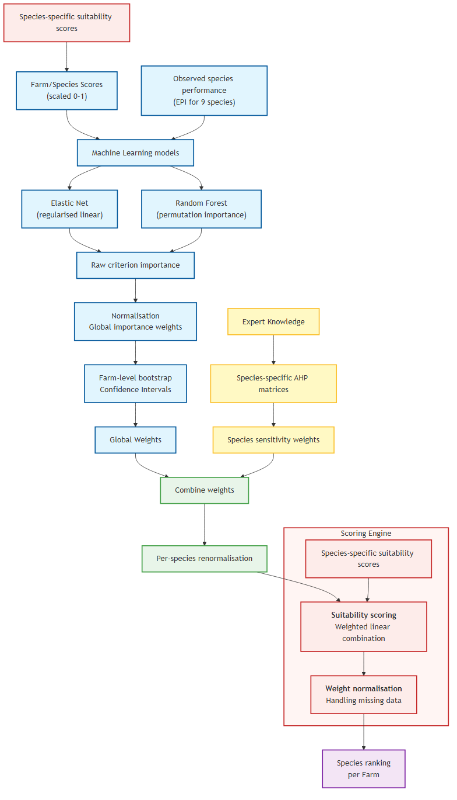

# Global Weight Extraction and Integration with AHP for Species Ranking Using MCDA Scoring Engine

## 1. Introduction

Selecting appropriate tree species for farms requires balancing multiple environmental criteria that jointly influence species performance. Multi‑Criteria Decision Analysis (MCDA) provides a transparent framework for aggregating such criteria; however, its effectiveness depends critically on how criterion weights are specified.

This document describes a hybrid data‑driven and expert‑informed weighting framework in the Planting Optimisation Tool (POT) in which:

1.  Global criterion importance weights are learned empirically from observed farm–species performance data using machine‑learning (ML) models, and
2.  Species‑specific sensitivity modifiers are derived using the Analytic Hierarchy Process (AHP) based on expert knowledge.

The two components are explicitly separated to avoid conceptual overlap and double-counting. Global weights capture *system‑level importance* of environmental criteria, while AHP captures *species‑level sensitivity* to those criteria.


## 2. Data and Data Cleaning

### TreeO2 dataset preparation and cleaning

The available dataset (TreeO2, December 5th 2025) consists of tree monitoring data collected from farmers across multiple municipalities in Timor-Leste. Because the raw field data is subject to entry errors, missing values, and reuse of physical tags (`fob_id`), a rigorous data cleaning pipeline is required to extract reliable survival outcomes and environmental features for predictive modelling. The cleaning pipeline was conducted as part of the survivability modelling work and is contained in the `datasciece/notebooks/survivability_model.ipynb` notebook. Within the notebook, the following processes were conducted:

**Standardisation and base cleaning**

The first phase of the cleaning process ensures data consistency and structural integrity. All duplicate rows are removed, and records missing critical numeric fields—such as trunk circumference, planting year, planting month, and farmer IDs are dropped from the dataset. To ensure categorical uniformity, the `tree_species` column undergoes extensive string manipulation: parenthetical text and excess spaces are removed, hyphenation is standardised, and names are correctly capitalised. Additionally, known local aliases are mapped to canonical names to align with the species data in the POT database.

**Tag recycling and survival inference**

A core challenge of the TreeO2 dataset is determining actual tree mortality, as physical NFC tags (`fob_id`) are frequently moved from dead trees to newly planted saplings. The pipeline algorithmically detects these "recycled" tags by tracking the chronological order of scans and flagging impossible biological or spatial jumps. Anomalies such as spatial shifts exceeding 50 meters, trunk circumference drops greater than 20%, or sudden changes in tree species, planting year, or farm ownership trigger a "recycled" flag. Based on these detected changes, the pipeline splits a single `fob_id` into distinct lifecycles (`tree_instance_id`). If a tag progresses to a new lifecycle, the previous instance is definitively classified as dead (`is_dead = 1`). 

**Geospatial imputation and boundary matching**

Finally, the pipeline rectifies geospatial inaccuracies to prepare the data for environmental feature extraction. Invalid coordinates (recorded as `-1`) are treated as missing and imputed using the geographic centroid of the respective farmer's previously scanned trees. The cleaned points are then converted to a local coordinate reference system (EPSG:32752) and spatially joined against a master database of mapped farm boundaries. Trees that fall precisely within a boundary, or sit within a calculated acceptable distance threshold (capped at 5 kilometres, driven by a 95th-percentile cutoff), are assigned a standardised `farm_id`. Any unmatched trees are dropped, resulting in a robust, geolocated dataset perfectly structured for machine learning.

### Growth cleaning and rate extraction
**Dataset augmentation and age calculation**

The output from the initial base-cleaning notebook is passed through a secondary Python script (`datascience/src/scripts/growth_cleaning.py`) designed specifically to handle the complexities of tree growth data. First, the script normalises tree species names and maps them to a standardised `species_id` using the reference dataset ingested into the POT database. It then calculates the exact fractional age of each tree at the time of scanning (`age_years_at_scan`) based on its planting date, and removes near-duplicate scans within a few days of each other to establish a clean, chronological timeline for each tree instance.

**Robust anomaly detection and correction**

Because physical measurements in the field are prone to entry errors (e.g., recording 10cm as 100cm), the script employs a rigorous statistical and rules-based cleaning pipeline to correct or drop impossible growth trajectories:

* Species-aware growth thresholds: The script calculates a 95th-percentile annual growth limit for each species based on valid near-annual scan intervals.

* Endpoint validation: The first and last scans of a tree's lifecycle are checked against the species threshold. If a tree exhibits impossible growth spikes at these endpoints, or if a single-scan tree is impossibly large for its age, the measurements are flagged for removal.

* Interior spike-revert interpolation: For middle scans, the script calculates expected values using linear interpolation between the previous and next valid scans. If an interior measurement deviates massively from this expectation (determined by a robust z-score cutoff) or forms a "spike-revert" pattern (a massive jump immediately followed by a drop), the erroneous value is replaced with the interpolated estimation.

* Cohort outlier removal: After chronological cleaning, a secondary statistical pass calculates robust z-scores on log-circumferences grouped by species and 1-year age bins, dropping any remaining statistical outliers.

**Growth Rate Extraction**

Once the measurements are validated, the script drops any tree instances with fewer than 2 remaining valid scans. For the surviving trees, it calculates a biologically realistic, annualised net growth rate (`net_growth_rate_cm_yr`) by comparing the first and last valid circumference measurements over the tree's recorded lifespan. Trees showing net-negative growth over a span greater than 6 months (indicating a missed tag reset) or exceeding biological maximums are filtered out.

**Generated Outputs**

The script finalises the pipeline by exporting three distinct artifacts for downstream analysis and reporting:

1.  Cleaned circumference data (`datascience/notebooks/farm_species_age_circumference.csv`): A dataset containing the corrected, scan-by-scan `trunk_circumference_clean` and exact age for every valid tree instance.

2.  Cleaned growth rates (`datascience/notebooks/farm_species_age_circumference_growth_rates.csv`): A summary dataset containing a single row per tree instance, featuring its total age span and calculated `net_growth_rate_cm_yr`.

3.  Visual QA report (`datascience.docs/Growth_Cleaning_Report.pdf`): An automated PDF document detailing the data retention metrics, alongside generated box-plots showing the distribution of trunk circumferences by age bin for each species, and a summary distribution of annualised growth rates.

**Why I measure rates, not size**

When evaluating environmental suitability, the ultimate goal is to answer: *"Which farms provide the best conditions for this species?"* Intuitively, one might assume that farms with the largest trees (the greatest trunk circumference) are the best environments. However, in biological data, absolute size is primarily a function of *time*, not just environment. Age is a major confounding variable. A 10-year-old tree planted in highly degraded, unsuitable soil will almost certainly have a larger absolute circumference than a 2-year-old tree planted in perfectly optimal conditions. If I attempt to correlate raw trunk circumference directly with environmental features (such as rainfall or pH), the statistical models will fatally misinterpret the data. The models will associate the environments of the older trees with "success", regardless of the actual soil quality.


### Isolating the environmental signal via age standardisation
Raw trunk circumferences and annualised growth rates cannot be directly compared across different environments because tree age remains an overwhelming confounding variable. To extract the true environmental signal, I must fully control for time.

The `datascience/src/scripts/gen_expected_performance_index.py` script achieves this by establishing an age-standardised biological baseline. By taking the annualised growth rate and standardising it through my modelling pipeline, the "Age Effect" is mathematically removed. This allows me to compare the biological efficiency of a 2-year-old sapling directly with that of a 10-year-old mature tree, cleanly isolating how the local environment accelerates or suppresses expected growth.

**Gamma GAM application**

To decouple tree age from environmental suitability, the script first calculates a "mid-age" to represent the tree's biological age during its measured growth window. It then fits a Gamma Generalised Additive Model (GAM) with a log-link function strictly against this age variable. Unlike standard linear regression, the Gamma distribution naturally handles right-skewed, strictly positive biological growth data and accounts for heteroscedasticity in tree maturity (variance increases with age). To prevent mathematical failure on trees that experienced zero net growth—a critical negative biological signal, an epsilon bound (`1e-9`) is applied to the predictions.

**Expected Performance Index (EPI)**

Once the GAM is fitted, it generates the predicted mean growth rate for a tree of any specific age. The script then calculates the Expected Performance Index (EPI) using a simple ratio: `Actual Growth / Expected Growth`. 

Pinning this baseline strictly at `1.0` creates a universal biological standard:

* EPI < 1.0: Indicates environmental suppression (e.g., poor soil, lack of rain).

* EPI > 1.0: Indicates an optimal environment that accelerates growth beyond standard biological expectations.

* *Example:* An EPI of 1.2 indicates a tree grew 20% faster than the species average for its exact age.

**Farm-level aggregation**

Before exporting the final metrics, the tree-level EPIs are aggregated to the farm level (grouped by `farm_id` and `species_id`). This vital step achieves two things:

1.  Noise reduction: Individual trees exhibit random variance (e.g., an isolated fungal infection or a lightning strike). Averaging the EPI of all trees of a specific species on a single farm smooths out this individual noise, yielding a highly stable "Farm Performance Score".

2.  Feature alignment: Because environmental features (Rainfall, Temperature, Soil texture) are scored at the farm level rather than the tree level, this aggregation perfectly aligns the target variable with the spatial inputs required for accurate mathematical extraction.

**Generated outputs**

The pipeline ultimately produces two artifacts:

1.  Aggregated EPI dataset (`datascience\src\scripts\aggregated_epi_data.csv`): The final, noise-reduced farm-level target variables, ready to be populated with the raw scores for each feature in each farm/species combination to be fed into downstream weight-extraction models.

2.  EPI visual report (`EPI_Report.pdf`): An automated PDF document detailing model fit statistics (AIC, Deviance), plotting the GAM fit curves with confidence intervals against observed data, generating species-specific EPI histograms, and providing a violin plot to visualise the distribution of farm-level performance across all species.


### Feature alignment and final dataset assembly

**Bridging biological targets with environmental features**

The final step before predictive modelling can begin is to align the target variable, the Expected Performance Index (EPI), with the actual environmental conditions present at each farm. While the previous script successfully isolated the biological "Age Effect" to create a clean measure of environmental suitability (the EPI), the weight-extraction models still need to know *what* those environmental conditions were in order to learn from them. 

This merging script serves as the bridge between the cleaned biological data and the backend environmental scoring engine.

## Targeted feature extraction
To optimise processing and avoid unnecessary calculations, targeted feature extraction is now handled via a dedicated EPI service endpoint `/global-weights/epi-add-scores`.

This endpoint accepts the cleaned `aggregated_epi_data.csv` file as input. Upon upload, the service inspects the dataset to identify the exact subset of unique farms (`farm_id`) and tree species (`species_id`) represented in the observations.

These identifiers are then passed to a service layer that acts as an interface to the core suitability engine. This service fetches the required farm profiles and species parameter sets from the database, constructs optimised scoring rules, and computes raw, unweighted feature scores (e.g. `rainfall_mm`, `temperature_celsius`, `elevation_m`, `ph`, `soil_texture`) specifically for the requested farm–species combinations.

The resulting raw environmental scores are returned as a flat result set and are left‑joined back onto the original `aggregated_epi_data.csv`, matching exactly on `farm_id` and `species_id`. This ensures that EPI observations are preserved.

The result is a downloadable machine‑learning‑ready dataset (`epi_farm_species_scores_data.csv`) consisting of observations indexed by farm and species, containing:

*   **Farm identifier** (`farm_id`)
*   **Species identifier** (`species_id`)
*   **Observed performance metric** (`farm_mean_epi`), representing the expected performance index (EPI) for a given species on a given farm
*   **Environmental variables**, expressed as continuous scores in the range $$[0, 1]$$, representing the relative favourability of each environmental criterion at a farm (e.g.`rainfall_mm`, `temperature_celsius`, `elevation_m`)

Not all species are present on all farms, and the EPI is recognised as noisy due to unobserved factors (management, genetics, local site effects). The modelling objective is therefore **not precise performance prediction**, but robust estimation of **relative importance among environmental criteria**.


The following diagram provides a system‑level overview of the full workflow for deriving global environmental importance weights from observed farm–species performance data, integrating expert‑elicited species sensitivities via AHP, and producing final MCDA‑based species rankings.



## 3. Conceptual separation: Global importance vs Sensitivity

A central design principle of this framework is the strict separation of two distinct concepts:

*   **Global importance (system‑level):**
    How important is each environmental criterion, *on average*, for discriminating between higher and lower species performance across farms?

*   **Species sensitivity (species‑level):**
    Given that a criterion is important in general, how strongly does a particular species respond to variation in that criterion relative to other criteria?


### Rationale for global criterion weights
A critical methodological decision is not to extract species-specific weights directly from the performance data. Conflating these two roles by calculating separate ML weights for every species is avoided for two main reasons:

1. Conceptual alignment with MCDA principles: In Multi-Criteria Decision Analysis (MCDA), criterion weights represent the priorities of the *decision context* (the shared farm environment), not the properties of the alternatives (the species). Allowing importance weights to change arbitrarily per species would imply that the fundamental farm environment changes depending on the plant being considered. Instead, species differences, such as tolerance thresholds and stressor responses, belong purely in the *scoring layer* (via AHP modifiers and suitability functions), preserving a consistent baseline framework.

2. Statistical robustness
Attempting to learn species-specific weights directly from historical performance data is statistically problematic. Because data is partitioned across species, the effective sample size per species drops significantly. Combined with the natural noise of biological data (e.g., unobserved management practices or micro-site variations) and baseline species effects, species-specific modelling leads to severe over-fitting, weight instability, and noise amplification.


### Implications and advantages
By treating criterion importance as a global property of the farm environment (ML) and treating biological differences as species-specific scores (AHP), the framework yields several key advantages:

* Stability and robustness: Global weights maximise the full dataset's information, minimising variance and stabilising MCDA rankings.

* Interpretability: Differences in final species rankings clearly arise from *species responses* to the same environmental priorities, rather than a murky redefinition of those priorities.

* Scalability: Global weights can be confidently applied to new or unobserved species that lack historical performance data, provided their biological suitability profiles are known.


## 4. Global weight extraction using Machine Learning


### 4.1 Model formulation

Global importance weights are estimated by fitting pooled ML models to the full dataset, using:

*   Target variable: `farm_mean_epi`
*   Predictors: environmental criteria (scaled to [0, 1])
*   Control variable: species identity (encoded as a categorical variable)

Species identity is included only to absorb species‑specific baseline differences, ensuring that estimated importance reflects shared environmental effects rather than differences in average species performance.

Conceptually, the model estimates:

$$
\text{EPI}_{f,s} = \alpha_s + g(\mathbf{x}_f) + \varepsilon_{f,s}
$$

where $`\alpha_s`$ is a species‑specific intercept and $`g(\cdot)`$ represents the shared effect of environmental conditions at farm $`f`$.


### 4.2 Choice of models

Two complementary model classes are used:

1.  Elastic Net regression
    *   Provides stable, global coefficients under multicollinearity

    *   Coefficients are directly comparable due to predictor scaling

2.  Random Forest regression
    *   Captures nonlinear and interaction effects

    *   Importance is extracted using permutation‑based methods

Predictive performance (e.g. $`R^2`$) is deliberately *not* optimised. Hyperparameters are chosen conservatively to suppress over-fitting and noise amplification.


### 4.3 Importance extraction

Raw model parameters are not used directly as MCDA weights. Instead, importance is defined as loss of information, measured by:

*   Absolute regularised coefficients (Elastic Net), or

*   Permutation importance (Random Forest), i.e. the increase in error when a criterion is permuted.

These importance values are:

*   Non‑negative

*   Comparable across criteria

*   Conditional on all other predictors


### 4.4 Normalisation to MCDA weights

For each criterion $`j`$, raw importance values $`I_j`$ are normalised to obtain global weights:

$$
w_j^{\text{global}} = \frac{I_j}{\sum_k I_k}
$$

This ensures:

*   $`w_j^{\text{global}} \ge 0`$
*   $`\sum_j w_j^{\text{global}} = 1`$

The resulting vector defines the global importance structure used in MCDA.


### 4.5 Uncertainty assessment via bootstrap

To quantify uncertainty and assess robustness, a farm‑level block bootstrap is applied.

*   Farms are resampled with replacement.

*   All species observations for each selected farm are retained.

*   The full model–importance–normalisation process is repeated.

*   The empirical distribution of weights yields confidence intervals (CIs).

Bootstrapping is not required to compute point estimates of global weights, but it provides valuable insight into:

*   Weight stability

*   Ranking robustness

*   Sensitivity of MCDA outcomes to data variability

### 4.6 Updating global weights

Once the combined EPI and raw-feature dataset has been generated (`epi_farm_species_scores_data.csv`), global weights can be recalculated using the provided data-science workflow.

The `epi_farm_species_scores_data.csv` file should be placed in the following directory:

```text
datascience/src/scripts
```

A Python script, `calculate_global_weights`, is provided to read this file and execute the machine‑learning pipeline described above. This process estimates the relative importance of each environmental feature in explaining observed EPI variation across farms and species.

The output of this script is a timestamped CSV file of the form:

```text
global_weights_<date>_<time>.csv
```

This output file can then be uploaded to the POT via the `/global-weights/import` API endpoint using the UI. The endpoint performs structural and value‑level validation on the uploaded data before persisting it to the database.

When global weights are available, the most recent valid version is always used during suitability scoring. If no global weights are present in the system, all environmental features are assumed to have equal importance, and the AHP‑derived criterion weights are used directly as the effective importance weights.

This design ensures that scoring remains robust and operationally continuous, while allowing global weights to be updated transparently as new data or improved modelling becomes available.


## 5. Role of AHP: species‑specific sensitivity modifiers

AHP is applied separately for each species to elicit expert judgement about relative sensitivity to environmental criteria.

Pairwise comparisons are framed as:

"For this species, which environmental factor has a stronger influence on performance when it varies?"

The resulting AHP weights:

$$
w_{s,j}^{\text{AHP}}
$$

represent relative sensitivity rather than global importance. They are species‑conditional and may differ substantially across species.


## 6. Combining global weights and AHP sensitivities

To integrate empirical and expert information while avoiding double-counting, global ML weights and AHP sensitivities are combined multiplicatively:

$$
\tilde{w}_{s,j} = w_j^{\text{global}} \times w_{s,j}^{\text{AHP}}
$$

The resulting values are renormalised for each species:

$$
w_{s,j} =
\frac{\tilde{w}_{s,j}}{\sum_k \tilde{w}_{s,k}}
$$

This formulation ensures that:

*   Global weights define the overall importance structure.

*   AHP modifies this structure to reflect species‑specific responses.

*   No criterion can become dominant for a species unless it is important globally.


## 7. MCDA species scoring and ranking

For a given farm $`f`$, species are ranked using a weighted additive MCDA model:

$$
\text{Score}_{s,f} = \sum_j w_{s,j} \cdot \text{Suitability}_{s,j}(f)
$$

where:

*   $`\text{Suitability}_{s,j}(f) \in [0,1]`$ is the species‑specific suitability score for criterion $`j`$ on farm $`f`$
*   $`w_{s,j}`$ are the combined weights defined above

Species are ranked in descending order of $`\text{Score}_{s,f}`$.

See [Scoring Design Documentation](https://github.com/Chameleon-company/Planting-Optimisation-Tool/blob/master/datascience/docs/scoring_design.md)


## 8. Applicability beyond observed species

Global weights are system‑level parameters and may be applied to species not present in the performance dataset, provided that:

*   Environmental criteria are defined consistently

*   Species‑specific suitability and AHP sensitivity information are available

*   New species fall within the ecological scope of the observed system

This allows the framework to scale from the 9 observed species to a larger candidate set without re‑estimating global importance.


## 9. When should the global weights be updated

The scoring has three distinct layers:

1.  Scoring layer: Raw environment → species-specific suitability scores in [0,1] (depends on species parameters: optima, tolerances, plateaus, etc.)

2.  Global importance layer: ML learns which criteria matter overall, using:

    *   EPI (target)

    *   Environmental scores

    *   Species as a control

3.  Decision layer (MCDA): Global weights × species sensitivities (AHP) × farm scores

This table shows when the global importance weights should be recalculated.

| Change                               | Recompute global weights?  |
| ------------------------------------ | -------------------------  |
| Species tolerance / AHP change       | ❌ No                      |
| Minor scoring curve tweaks           | ❌ Usually no              |
| Score method  changed                | ✅ Yes                     |
| New criteria added                   | ✅ Yes                     |
| Criteria removed                     | ✅ Yes                     |
| Score distributions collapse or flip | ✅ Yes                     |
| More data gathered                   | ✅ Yes                     |

The `/global-weights/epi-add-scores` endpoint was added to the POT to support re‑generation of the combined EPI and raw environmental feature scores in cases where the underlying scoring methods change. This ensures that downstream machine‑learning datasets remain consistent with the current suitability engine logic without requiring manual recomputation.


## 10. Summary and Key Advantages

The proposed framework:

*   Separates importance from sensitivity

*   Anchors weights in observed data while preserving expert knowledge

*   Avoids over-fitting and instability

*   Supports transparent uncertainty assessment

*   Remains extensible to new species and scenarios

By design, it prioritises robust decision support over predictive accuracy, making it well-suited to real-world species-selection problems under uncertainty.

## Appendix A: End‑to‑end workflow


1. Clean raw TreeO2 scan data
   *(TreeO2 dataset preparation and base cleaning; survivability modelling pipeline in `datascience/notebooks/survivability_model.ipynb`).*

2. Extract biologically realistic growth rates
   *(Growth validation, anomaly correction, and annualised rate extraction using `datascience/src/scripts/growth_cleaning.py`).*

3. Fit a Gamma GAM per species to remove age effects and compute tree‑level EPI and aggregate to farm × species
   *(Age‑only Gamma GAM fitted in `datascience/src/scripts/gen_expected_performance_index.py`).*

4. Upload `aggregated_epi_data.csv` to the `/global-weights/epi-add-scores` API endpoint using the UI.
   *(POT backend triggers targeted raw feature score regeneration via the suitability engine).*

5. Receive `epi_farm_species_scores_data.csv`
   *(Combined dataset containing farm‑level EPI and raw environmental feature scores, left‑joined on `farm_id` and `species_id`).*

6. Run `calculate_global_weights.py` to learn global importance weights
   *(Executed from `datascience/src/scripts`, applying pooled ML models and normalisation).*

7. Upload the resulting `global_weights_<date>_<time>.csv` to the `/global-weights/import` API endpoint via the UI.
   *(Endpoint validates structure and values before persisting weights to the POT database).*

8. MCDA scoring automatically uses the latest valid global weights  
    *(If no global weights exist, equal weights are assumed and AHP sensitivities act as effective importance weights).*
